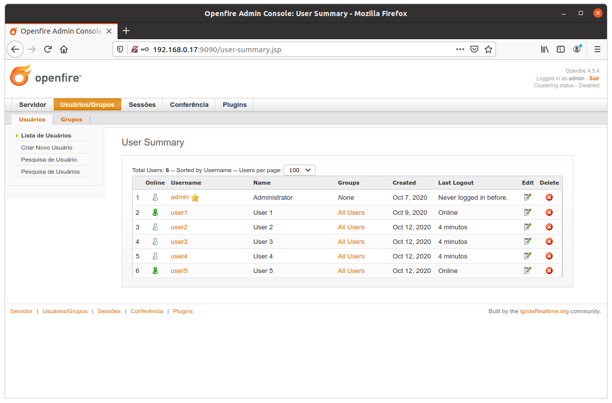

# OpenfireDroid

An Android client for [XMPP Openfire](https://www.igniterealtime.org/projects/openfire/) instant messaging.

## Openfire

Openfire is a real time collaboration (RTC) server licensed under the Open Source Apache License. 
It uses the only widely adopted open protocol for instant messaging.
XMPP Openfire is incredibly easy to setup and administer, but offers rock-solid security and performance.
_(See references at bottom)_

### Openfire Instalation

Installation of Openfire on Ubuntu is a pretty straightforward process. 
Follow steps below to have Openfire installed and configured on your system.

#### Update system packages
```
sudo apt-get update
sudo apt-get upgrade
```

#### Install JAVA JDK
```
sudo apt-get install openjdk-8-jdk
```

#### Install MySQL/MariaDB Database server
```
sudo apt install mariadb-server
```

Once you got your MySQl/MariaDB up and running, create a database for Openfire:
```
sudo mysql -u root

CREATE DATABASE openfire;
GRANT ALL PRIVILEGES ON openfire.* TO openfire@localhost IDENTIFIED BY 'StrongP@ssword123!';
FLUSH PRIVILEGES;
QUIT
```

#### Download and Install Openfire
Go to (Openfire downloads)[https://www.igniterealtime.org/downloads/] and download the latest openfire version.

Then, intall the file with:
```
sudo dpkg -i openfire.deb
```
And check the installation with
```
systemctl status openfire
```

#### Importing Openfire database schema into MySQL/MariaDB
```
mysql -u root -p
Enter password: 
Welcome to the MySQL monitor. Commands end with ; or \g.
Your MySQL connection id is 6
Server version: 5.7.22-0ubuntu18.04.1 (Ubuntu)
Copyright (c) 2000, 2018, Oracle and/or its affiliates. All rights reserved.

Oracle is a registered trademark of Oracle Corporation and/or its
affiliates. Other names may be trademarks of their respective
owners.

Type 'help;' or '\h' for help. Type '\c' to clear the current input statement.

mysql> use openfire;
Database changed
mysql> source /usr/share/openfire/resources/database/openfire_mysql.sql;
mysql> show tables;
```

#### Configure Firewall and Access Openfire UI
```
sudo ufw enable
for i in 9090 9091 5222 7777; do 
sudo ufw allow $i; done
```

Now you shoud have your Openfire server running at: http://127.0.0.1:9090

Start Openfire console and create some users:




## References

* [Openfire - Ignite realtime](https://www.igniterealtime.org/projects/openfire/)
* [XMPP](https://xmpp.org/)
* [Install Openfire XMPP Chat Server on Ubuntu 18.04|16.04](https://computingforgeeks.com/install-openfire-xmpp-chat-server-on-ubuntu-linux/)
* [Smack 4.2 Readme and Upgrade Guide](https://github.com/igniterealtime/Smack/wiki/Smack-4.2-Readme-and-Upgrade-Guide)
* [Smack Documentation](https://github.com/igniterealtime/Smack/blob/master/documentation/index.md)
* [https://stackoverflow.com](https://stackoverflow.com/questions/43143359/error-on-smack-4-2-0-in-aaaa-yielded-an-error-response-nx-domain)
* [XMPP register login and chat basic example](https://androidpedia.net/en/tutorial/6747/xmpp-register-login-and-chat-simple-example)
 
## Credits

Icons made by [Freepik](http://www.freepik.com) from [www.flaticon.com](https://www.flaticon.com/)


## Licenses

[MIT](https://choosealicense.com/licenses/mit/)